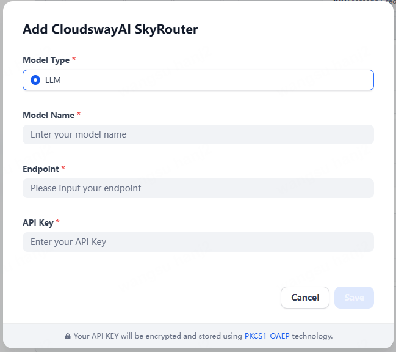

## cloudswayai_skyrouter

**Author:** cloudswayAI
**Version:** 0.0.1
**Type:** model

### Description

Skyrouter is an AI model aggregation tool built on the Dify ecosystem. Through standardized API interfaces, it supports major closed-source and open-source models worldwide.

### Key Features

- Supports major global closed-source and open-source models with unified interface specifications
- Network acceleration and intelligent routing ensure service stability and response speed

### Confiure

#### 1. Apply for the Endpoint and API Key

Please contact us `info@cloudsway.ai` to apply for the Endpoint and API key.

#### 2. Add Model

After installing the plugin, go to the user center and add model in the Model Provider page

**Note:** The model name must be within the following range:

- openai/gpt-5
- openai/gpt-5-chat
- openai/gpt-5-mini
- openai/gpt-5-nano
- openai/o4-mini-high
- openai/o3-mini-high
- openai/o3-mini
- openai/o3-mini-2025-01-31
- openai/o1-preview
- openai/o1-mini
- openai/gpt-4.1
- openai/gpt-4.1-mini
- openai/gpt-4.1-nano
- openai/chatgpt-4o-latest
- openai/gpt-4o-2024-11-20
- openai/gpt-4o
- openai/gpt-4o-mini
- openai/gpt-4
- openai/gpt-3.5-turbo
- anthropic/claude-opus-4
- anthropic/claude-opus-4.1
- anthropic/claude-sonnet-4
- anthropic/claude-3.7-sonnet
- anthropic/claude-3.5-sonnet
- anthropic/claude-3-haiku
- anthropic/claude-3-opus
- anthropic/claude-3-sonnet
- google/gemini-2.5-pro
- google/gemini-2.5-flash
- google/gemini-2.5-flash-lite
- google/gemini-2.5-flash-lite-preview-06-17
- google/gemini-2.0-flash-lite-001
- google/gemini-pro-1.5
- google/gemini-flash-1.5
- google/gemini-pro

### Privacy Policy

- **Types of data collected**：This plugin collects only the keywords entered by users (`query`) for real-time invocation of the AI model API provided by Cloudsway. The plugin does not collect any personally identifiable information such as names, email addresses, or device details.
- **Data Usage**：All inputs are used solely for AI model requests and are not stored persistently, analyzed, or used for any other purpose.
- **Third-party processing**：Requests are processed in real time by the Cloudsway API. Data is transmitted to Cloudsway solely during the request process and is not shared with any third parties.
- **Safety Measures**：API keys are used solely for authentication and are neither stored nor disclosed by the plugin. All data transfers are encrypted via HTTPS.
- **User Rights**：Users can delete or replace API keys at any time; the plugin does not store any historical data.
- **Support and Feedback**：For privacy-related inquiries, please contact us at support@cloudsway.ai.